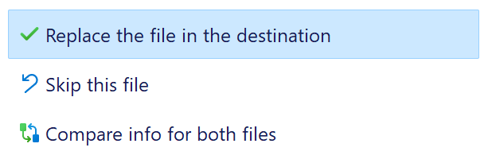

# Stratasys Mojo Retrofit

Stratasys has ended support for their Mojo 3D printers, and you can no longer purchase parts or filament for them.
This project aims to retrofit them with off-the-shelf parts to extend their lifespan.

## Parts

Here is an example parts list that may be used for this conversion. This assumes that you repurpose the
old printer's ATX power supply and CoreXY mechanics. Minmimal irreversible changes are made to the machine,
although that doesn't really matter at this point!

I converted two printers at once for $300, a slight cost savings due to higher quantity of GT2 pulleys resulting in a lower individual price, as well as the endstops comkng in packages of six.

|         **Item**        |                **URL**                  | **Price** | **Quantity** | **Total Cost** |
|:-----------------------:|:---------------------------------------:|:---------:|:------------:|:--------------:|
| Chimera hotend          | <https://www.amazon.com/dp/B08BKMM1R7/> | $20       | 1            | $20            |
| Extruder                | <https://www.amazon.com/dp/B0BZD8JMPR/> | $9        | 2            | $18            |
| Control board           | <https://www.amazon.com/dp/B08PCX6TM7/> | $42       | 1            | $42            |
| Endstops                | <https://www.amazon.com/dp/B07PCN6T6F/> | $11       | 1            | $11            |
| PTFE tubing             | <https://www.amazon.com/dp/B01CUPV90M/> | $8        | 1            | $8             |
| Stepper motors          | <https://www.amazon.com/dp/B0817TS61F/> | $38       | 1            | $38            |
| LCD display             | <https://www.amazon.com/dp/B08HLSCHVL/> | $12       | 1            | $12            |
| GT2 timing belt pulleys | <https://www.amazon.com/dp/B07BT6N12L/> | $8        | 1            | $8             |
| 4010 fan                | <https://www.amazon.com/dp/B0B1N6NSGM/> | $9        | 1            | $9             |
| **Total**               |                                         |           |              | **$166**       |

### 3D Printed Parts

In the `cad/` subdirectory, I have included designs in both Fusion 360 and STEP formats for you to customize and export. STLs and potentially Printables links coming soon!

## Assembly

In lieu of a full assembly guide (right now), I'll just add some notes.

- If you're not using a heated bed, just power the control board off of the power supply's PCIe power
  - Snip off the last couple of inches of the header
  - Twist together the three yellow wires, then separately twist together the three black wires
  - Maybe put a blob of solder on the twists to keep them in place while inserting into the control board's screw terminals
- When viewing the printer **from the back**, the left motor should be plugged into the **X** connector and the right motor into the **Y** connector
- You'll need to drill some ~1" holes through the side panels and filament buckets to accomodate a dowel rod for the filament spool
  - Alternatively, for a no-damage installation, print first one of the filament spool holder designs that uses bearings and rollers to support the filament and allow it to spin freely

## Firmware

The firmware for the prototype single extruder system is based on Marlin 2.0.9.7 LTS which is not recommended for use with "modern" boards. For that machine, I was reusing an old mega2560 MKS Base v1.4 control board, but I could have used a newer Marlin version, and I'd suggest you update the config to do that.

The dual nozzle version is currently based on Marlin 2.1-bugfix as of 5 April 2024, but I intend to upgrade it to 2.1.3 when that becomes available. I'm using the MKS Eagle (basically Robin Nano with builtin drivers) for the production version, so the config files and binary reflect that.

### Build and Upload

As this was my first time dealing with a 32-bit control board, the process for uploading firmware was initially foreign to me. *Here's the process I found to be best for quick iteration:*

1. Clone or download [makerbase-mks/MKS-EAGLE](https://github.com/makerbase-mks/MKS-EAGLE)
2. Clone or download this repository (for easy access to the Marlin configuration files)
3. Download and extract the appropriate version of Marlin from [this page](https://marlinfw.org/meta/download/)
4. Copy the configuration files from the Marlin folder in this repository, and paste them in the Marlin subfolder that you extracted. You should see in the same directory the folders `lib` and `src` in addition to the file `Marlin.ino` if you're in the right place.
5. Install [Visual Studio Code](https://code.visualstudio.com/#alt-downloads) using the download link for your platform
4. Set up Auto Build Marlin according to [these instructions](https://marlinfw.org/docs/basics/auto_build_marlin.html)
5. Customize the example configuration
6. Build using the Build button in the Auto Build Marlin window
7. Find your `mks_eagle.bin` output file. It should be located in `../.pio' folder (one level outside of the Marlin folder)
8. Copy `mks_eagle.bin` to the `DFU-upload` folder downloaded from the MKS-EAGLE repository. Overwrite the `mks_eagle.bin` that's already there.
9.  Ensure that your control board is entirely unpowered, then move the board's power jumper (near the USB Type B port and microSD slot) to USB power (on)
10. Press and hold the `BOOT0` button on the board, then plug it in to your computer using the included cable. Once it's plugged in, release the button.
11. Download and run the latest version of [Zadig](https://zadig.akeo.ie/), which will help install necessary USB drivers.
12. Once Zadig is running, click `Options` then `List All Devices` then select from the top dropdown a device like `STM Bootloader`
13. Set the driver in the right-side combobox to WinUSB, and then click `Replace Driver`. This process can surprisingly take a few minutes to complete.

14. In the `MKS-EAGLE/DFU-upload` folder, run `DFU-Upload-firmware.bat`
15. Once flashing is complete, unplug the board and change the power jumper back to off (so no USB power)
16. Turn on your power supply and test the firmware!

## Slicer

I selected PrusaSlicer for its robustness and ease of customization, however, I believe that derivatives such as SuperSlicer or OrcaSlicer will also work.
Or, if you prefer Cura, as I do for my other machines, the configuration should be easy enough to replicate.

1. Install [PrusaSlicer](https://www.prusa3d.com/en/page/prusaslicer_424/).
2. Copy the PrusaSlicer folder from this repository
3. Navigate to `C:/Users/YOUR_USERNAME/AppData/Roaming` in your file explorer. You can do this easily by typing in the directory bar `%APPDATA%` and pressing <kbd>Enter</kbd>.
4. Paste the PrusaSlicer folder, and select *Replace the file in the destination* if prompted. This will install the  filament settings, print settings, and printer settings I have tuned for the Stratasys Mojo conversion.

5. Open PrusaSlicer and navigate to *Printer Settings*.
6. Ensure that Expert mode is selected by pressing the button in the top right.
7. Navigate to *General* > *Bed Shape*.

8. Load the `Mojo Logo.png` file in this repository as the bed texture.
9. Load the `Accurate Mojo Build Plate.stl` file in this repository as the bed model.

## Instructions

I created a guide with instructions for a novice user to prepare a model for printing on one of these converted machines.
That document is available here: [Stratasys Mojo Instructions](https://docs.google.com/document/d/1dcEKFhcxA-QaMBZmRmVCBlgQjbNByx9ydnzFRXKonwo/edit?usp=sharing)

## TODO

- [x] Update to 2.1-bugfix
- [x] Implement M16 in print profile to ensure that the right profile (dual vs single extruder) was used
- [ ] Figure out feasibility of ATX power supply enable / disable and standby power
- [ ] Consider MPC temperature instead of PID
- [ ] Consider S-Curve acceleration
- [ ] Consider nozzle clean
- [ ] Enable linear advance
- [ ] Consider sensorless homing
